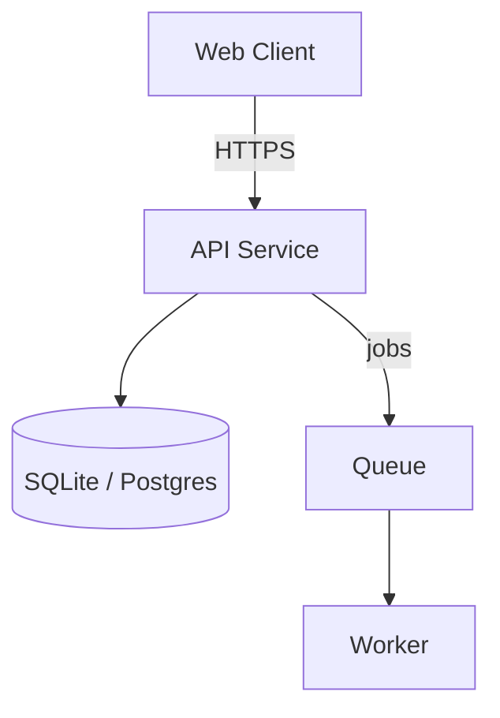

# System Design Skill (High-Level Architecture)

## Purpose

Produce a complete **high-level system architecture design**: what the system is, what components it has, how they interact, how data flows through it, and which key decisions were made and why. This is an architecture document — implementation specifics (entity field schemas, endpoint signatures, concurrency internals, CI pipeline steps) belong in a follow-up technical spec, not here.

## Core Principles

1. **Size first, always.** Never design without a sizing checkpoint. A personal tool and a public platform are different documents with different decisions.
2. **Boring architecture wins.** Prefer a modular monolith, synchronous calls, and a plain relational DB. Microservices, queues, and sharding are liabilities until a lane requires them.
3. **Mermaid-first diagrams.** Architecture diagrams are `mermaid` code blocks, not ASCII art. One diagram per critical flow.
4. **No guessing.** Requirements are clarified, not invented. If the user has not given scale, users, or constraints — ask before designing.
5. **Evidence over intuition.** Every architecture decision must cite a validated source — official guidelines, best practices, reference architectures, or case studies. Never invent a practice nobody has confirmed.
6. **Architecture, not implementation.** Every section stays at the level of components, responsibilities, and interactions. If you catch yourself writing field schemas, endpoint signatures, or thread-pool details — stop. Note it as "implementation detail — defer to tech spec".
7. **Always end with a build order.** A design nobody can implement is decoration. Ordered implementation milestones are mandatory output.

---

## Phase 0: Sizing Checkpoint (MANDATORY — before anything else)

Ask the user (via `ask_clarification` or direct questions) before any architecture work:

1. **Who uses it and how many?** (just you / team / public)
2. **Where does it run?** (your machine / one VPS / cluster)
3. **Budget and timeline?**
4. **Stack constraints?** (existing code, team skills, must-use technologies)

### Lane Classification

| Lane | Users | Deployment | Storage | Concurrency |
|---|---|---|---|---|
| **A — Local/Personal** | 1–10 | Single machine (Windows/Mac/Linux box) | SQLite (Postgres only if needed) | Processes + background tasks, no broker |
| **B — Team/Self-hosted** | 10–1,000 | 1–2 VPS, Docker + nginx | PostgreSQL + Redis | Worker process + DB-backed queue |
| **C — Scale-out** | 1,000+ / public | Cluster, auto-scaling | Postgres sharded + cache + object storage + CDN | Event-driven, partitioned queues, streaming |

**Rules:**
- Default to **Lane A** when the user gives no scale signals.
- Move up a lane only when there is explicit demand.
- If the user's answers are thin, ask follow-ups. Do not guess the lane.

---

## Phase 1: Requirements (Gate: Phase 0 confirmed)

Requirements are **architecture drivers**, not a product spec. Establish:

| Field | What It Drives |
|---|---|
| **System goal** | One-line purpose; the boundary of the design |
| **Functional requirements** | Which components must exist (group them, don't enumerate every feature) |
| **Non-functional requirements** | Scale, latency, availability, durability targets — these drive architecture choices |
| **Constraints** | Budget, time, team, stack — what the architecture must respect |

### Required Output

```
## Scope
- **Goal**: {goal}
- **Lane**: A / B / C
- **Users**: {count and growth}

## Functional Requirements (grouped)
1. {capability area} — e.g., "Messaging: send, receive, presence, history"
2. {capability area}

## Non-Functional Requirements
- **Latency**: {target}
- **Availability**: {target}
- **Scale**: {current and projected}

## Constraints
- **Team / Timeline / Budget / Stack**: {one line each}
```

---

## Phase 1.5: Evidence Gathering (Gate: requirements listed, before architecture)

Research before you design — never invent a practice nobody has validated.

### What to Research

- **Best practices / official guidelines** for the chosen stack and pattern
- **Reference architectures and case studies** of similar systems
- **Benchmarks** for decisions that depend on numbers (queue throughput, cache hit rates, DB size limits)
- **Known pitfalls** of the chosen pattern and how others mitigated them

### Minimum Bar

- At least 4 searches across different angles
- At least 2 full-source reads (web_fetch / fetch)
- Every non-obvious decision must be traceable to a source

### Required Output

A short **## Evidence** section listing sources with links, before the architecture:

```
## Evidence
- [Source 1](url) — best practice for {decision}
- [Source 2](url) — reference architecture of {similar system}
```

---

## Phase 2: High-Level Architecture (Gate: requirements listed + evidence gathered)

The core of this skill. Everything here is at the component level — nothing inside a component.

### Deliverables

1. **System context** — actors, system boundary, external systems (one short paragraph or table).
2. **One mermaid architecture diagram** (required — no ASCII art). Components, data stores, communication arrows. One diagram per critical flow if needed.
3. **Component decomposition table** — component, responsibility, communicates via, scaling strategy.
4. **Communication patterns** — for each link: sync (HTTP/gRPC) or async (queue/events), and why.

### Output Template

```
## Architecture Overview

### Context
{actors, boundary, external systems}

### Diagram


### Component Decomposition
| Component | Responsibility | Communicates via | Scaling Strategy |
|---|---|---|---|
| API Service | Business logic, auth | HTTP | Single process (Lane A) |
| Worker | Async jobs | Queue | N workers (Lane B) |

### Communication Patterns
| Link | Mechanism | Why |
|---|---|---|
| Client → API | Sync HTTP | Request/response |
| API → Worker | Async queue | Decouple slow work |
```

**Stop here.** Do NOT descend into per-component internals (API surface definitions, state management inside a component, concurrency models). Those are implementation details.

---

## Phase 3: Data Flow & Storage (Gate: architecture presented)

System-level only.

### Data Flow

Trace the critical paths **through the components**:

| Path | What Happens (component-level) |
|---|---|
| **Write** | Client → API → DB; what the API does is implementation detail |
| **Read** | Client → API → DB / cache |
| **Async** | API → queue → worker → DB / external |

### Storage Choices

| Data Type | Technology | Rationale |
|---|---|---|
| Core records | SQLite (A) / PostgreSQL (B+) | ACID, boring |
| Cache | Redis (B+) | Low-latency reads |
| Files | Local disk (A) / object storage (C) | Blob storage |

### Consistency (system level)

Where strong consistency is required, where eventual is acceptable, and the staleness target. No cache-invalidation implementation details.

---

## Phase 4: Key Architecture Decisions (Gate: data flow traced)

A short section documenting the decisions that shape the whole system — with alternatives and rationale:

| Decision | Choice | Alternative Considered | Why Not |
|---|---|---|---|
| Style | Modular monolith | Microservices | No team/scale to justify it |
| Storage | SQLite → Postgres | Cassandra | Overkill for the lane |
| Deployment | Single machine | Kubernetes | Lane A; ops cost not justified |

Also record: scale characteristics (current + projected per lane) and what would force a lane change.

---

## Phase 5: Tradeoffs, Risks & Build Order (Gate: decisions recorded)

### Tradeoff Table

| Decision | Rationale | Alternative | Why Not |
|---|---|---|---|
| {decision} | {reason} | {alternative} | {drawback} |

### Risk Table (architecture-level)

| Risk | Likelihood | Impact | Mitigation |
|---|---|---|---|
| {risk} | H/M/L | H/M/L | {concrete action} |

### Build Order (mandatory — milestones, not file-level tasks)

1. Skeleton: repo layout, lint, empty app boots
2. Core write path end-to-end
3. Core read path + UI
4. Auth + storage extensions
5. Async work
6. Hardening: errors, retries, observability
7. Deployment + backup runbook

---

## Bare Minimum (any lane)

Under tight constraints, at minimum deliver:

1. Sizing lane confirmed (Phase 0)
2. Requirements listed (goal, FR, NFR, constraints)
3. One mermaid architecture diagram
4. Component decomposition + storage choices
5. Write + read path traced at system level
6. One tradeoff + the build order
7. Key decisions cited (evidence phase)

## Output

Present the complete document via `present_file`:

```
# System Design: {System Name}

## 1. Sizing & Requirements
## 1.5 Evidence & Sources
## 2. High-Level Architecture  (context, mermaid diagram, components, communication)
## 3. Data Flow & Storage
## 4. Key Architecture Decisions
## 5. Tradeoffs, Risks & Build Order
```
